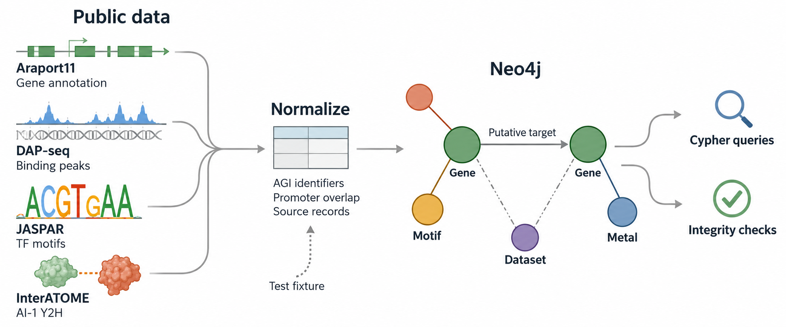

# Arabidopsis Metal Homeostasis Knowledge Graph

[](https://github.com/piercetaylor/arabidopsis-metal-homeostasis-kg/actions/workflows/ci.yml)

Which transcription factors bind near iron-homeostasis genes, and how do their
motifs and protein interactions connect? This project brings those records
together in Neo4j, using public *Arabidopsis thaliana* data.



## Data

- [Araport11](https://doi.org/10.5281/zenodo.17371665): gene coordinates and symbols, pinned to the 2024-10-01 snapshot.
- [DAP-seq, GSE60141](https://www.ncbi.nlm.nih.gov/geo/query/acc.cgi?acc=GSE60141): transcription-factor binding peaks.
- [JASPAR CORE 2026](https://jaspar.elixir.no/): Arabidopsis transcription-factor motifs.
- [InterATOME 1.1](https://doi.org/10.15454/5I2RO1): the AI-1 yeast two-hybrid subset from the ORFeome-scale interactome screen.

The [verified full build](docs/verification/full-data-build.md) contains 33,318 genes,
598 motifs, 6,438 Y2H pairs and 1,172,835 putative DAP-seq target relationships.
All four validation suites passed. Downloads stay out of Git; source versions,
checksums, citations and reuse terms are in [data provenance](docs/data-provenance.md)
and the [input snapshot](docs/verification/source-snapshot.json).

## Run locally

You'll need Python 3.11+ and Docker Compose. From the repository root:

```bash
python -m venv .venv
source .venv/bin/activate
python -m pip install -e ".[dev]"
cp .env.example .env
docker compose up -d --wait
plant-kg pipeline --profile fixture
```

In PowerShell, use `.venv\Scripts\Activate.ps1` and `Copy-Item .env.example .env`
for activation and copying. The fixture runs offline and is for testing only.

Open [Neo4j Browser](http://localhost:7474) with user `neo4j` and password
`plantgraph-local`. Keep these defaults local. `docker compose down` stops the
service without deleting its data.

For the public datasets, switch to a separate volume so synthetic fixture records
don't mix with real evidence. Allow extra disk space and network access:

```bash
docker compose down
docker compose --project-name plant-kg-full up -d --wait
plant-kg pipeline --profile full
```

Stop that instance with `docker compose --project-name plant-kg-full down`.

## Explore and check

Start with the [metal regulatory neighborhood](cypher/examples/metal_regulatory_neighborhood.cypher),
[motif-supported regulators](cypher/examples/motif_supported_regulators.cypher)
or [convergent evidence](cypher/examples/convergent_evidence.cypher) queries.

`plant-kg validate` checks identifiers, coordinates, provenance and relationship
integrity. Unique constraints protect node keys; loading the same tables twice
doesn't duplicate the graph. [GitHub Actions](https://github.com/piercetaylor/arabidopsis-metal-homeostasis-kg/actions/workflows/ci.yml)
runs pytest against an isolated Neo4j service. For local tests, see [Contributing](CONTRIBUTING.md).

## Reading the evidence

DAP-seq measures binding *in vitro*. A peak within 2,000 bp upstream to 500 bp
downstream of a strand-aware transcription start site creates a putative target,
not a validated regulatory relationship. Motif links require exact Araport symbol
matches, so some aliases are missed.

Y2H edges describe binary assay observations at the gene-locus level, without
isoform, tissue or condition specificity. The four iron-homeostasis seed genes
are starting points for queries, not a complete metal-homeostasis catalog.

[Architecture](docs/architecture.md) · [Data dictionary](docs/data-dictionary.md) ·
[Citation](CITATION.cff) · [MIT license](LICENSE). The license covers code and
documentation; upstream data keep their own terms.
