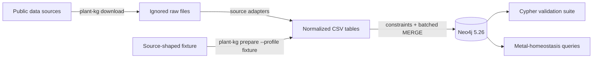
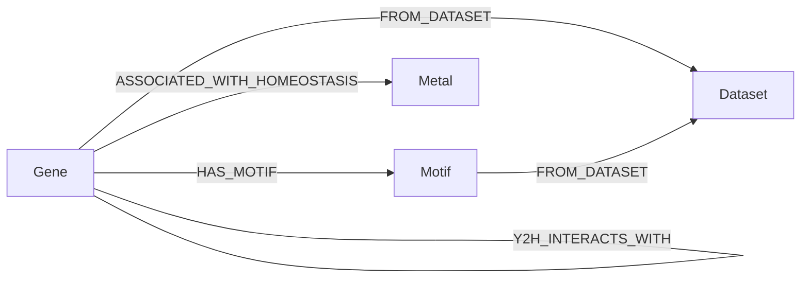

# Arabidopsis Metal Homeostasis Knowledge Graph

[](https://github.com/piercetaylor/arabidopsis-metal-homeostasis-kg/actions/workflows/ci.yml)

A reproducible Neo4j knowledge graph that connects *Arabidopsis thaliana* gene
annotation, DAP-seq binding evidence, JASPAR transcription-factor motifs, and
ORFeome-scale yeast two-hybrid interactions around metal-homeostasis genes.

The project emphasizes traceable transformations and conservative biological
claims. In particular, DAP-seq peaks are represented as **putative** targets only
when they overlap a declared strand-aware promoter window. A small bundled fixture
exercises the software; full upstream datasets are downloaded on demand and never
committed to the repository.

## Architecture



See [architecture](docs/architecture.md), [data dictionary](docs/data-dictionary.md),
and [data provenance](docs/data-provenance.md) for the detailed contracts.

## Public data sources

| Layer | Version used | Citation | Terms | Repository policy |
|---|---|---|---|---|
| [Araport11](https://doi.org/10.5281/zenodo.17371665) | Pinned 2024-10-01 snapshot | [Cheng et al. (2017)](https://doi.org/10.1111/tpj.13415) | Public Zenodo record; no reuse license stated | Downloaded, not redistributed |
| [NCBI GEO GSE60141](https://www.ncbi.nlm.nih.gov/geo/query/acc.cgi?acc=GSE60141) | Public DAP-seq processed peaks | [O'Malley et al. (2016)](https://doi.org/10.1016/j.cell.2016.04.038) | NCBI/GEO policies apply | Downloaded, not redistributed |
| [JASPAR CORE](https://jaspar.elixir.no/) | 2026, Arabidopsis records | [Ovek Baydar et al. (2026)](https://doi.org/10.1093/nar/gkaf1209) | [CC BY 4.0](https://creativecommons.org/licenses/by/4.0/) | Downloaded, not redistributed |
| [InterATOME](https://doi.org/10.15454/5I2RO1) | Public network 1.1, AI-1 Y2H subset | [Arabidopsis Interactome Mapping Consortium (2011)](https://doi.org/10.1126/science.1203877) | [Etalab Open Licence 2.0](https://www.etalab.gouv.fr/licence-ouverte-open-licence/) | Downloaded, not redistributed |

Upstream data retain their original terms. The MIT license in this repository
applies to the project code and documentation, not to downloaded datasets.

## Graph model



`Gene` uses an AGI locus identifier as its stable key. Y2H endpoints therefore
represent locus-level protein proxies rather than isoform-resolved protein products.

## Five-minute fixture quick start

Requirements: Python 3.11 or newer, Docker, and Docker Compose.

```bash
python -m venv .venv
source .venv/bin/activate
python -m pip install --upgrade pip
python -m pip install -e ".[dev]"
cp .env.example .env
docker compose up -d --wait
plant-kg pipeline --profile fixture
```

On Windows PowerShell, activate with `.venv\Scripts\Activate.ps1` and copy the
environment template with `Copy-Item .env.example .env`.

Neo4j Browser is available at <http://localhost:7474>. The local defaults are
user `neo4j`, password `plantgraph-local`, and database `neo4j`; change the
password before exposing the service beyond localhost.

Stop the service without deleting its named data volume:

```bash
docker compose down
```

## Full-data build

The full profile can be substantially larger than the fixture and requires network
access and disk space. Source locations are declared in `config/sources.toml`.

Use an empty Neo4j instance for the full build. Keep fixture and full graphs in
separate volumes because their shared gene IDs would otherwise mix synthetic
fixture records with real evidence. After the fixture quick start, switch to a
separate local Compose project:

```bash
docker compose down
docker compose --project-name plant-kg-full up -d --wait
```

```bash
plant-kg download
plant-kg prepare --profile full
plant-kg schema
plant-kg load
plant-kg validate
```

The equivalent end-to-end command is:

```bash
plant-kg pipeline --profile full
```

Downloads are written under `data/raw/`; normalized tables are written under
`data/processed/`. Both locations are ignored by Git. A download manifest records
retrieval time, byte size, source URL, and SHA-256 for each retrieved artifact.

The verified input snapshot is recorded in
[source-snapshot.json](docs/verification/source-snapshot.json). JASPAR is a live API;
compare its digest and retrieval date when reproducing an analysis.

The [full-data verification](docs/verification/full-data-build.md) records a
successful build with 33,318 genes, 598 motifs, 6,438 Y2H pairs, and 1,172,835
putative DAP-seq target relationships. All four Cypher validation suites passed.

Stop this instance with `docker compose --project-name plant-kg-full down`.
Its named data volume is retained for later use.

## Validation

`plant-kg validate` runs the version-controlled queries in `cypher/validation/`.
The command exits nonzero if required entities are absent, identifiers or coordinates
are malformed, provenance is missing, or relationship endpoints and required
properties violate the graph contract.

The schema is safe to apply repeatedly. Unique constraints protect `Dataset`, `Gene`,
`Motif`, and `Metal` keys, while the loader uses batched, parameterized `MERGE`
operations so an identical second load preserves graph cardinality.

## Example query

The query in `cypher/examples/metal_regulatory_neighborhood.cypher` follows a
metal-homeostasis seed through DAP-seq, motif, and Y2H evidence:

```cypher
MATCH (tf:Gene)-[binding:PUTATIVE_DAP_TARGET]->(target:Gene)
      -[:ASSOCIATED_WITH_HOMEOSTASIS]->(metal:Metal)
OPTIONAL MATCH (tf)-[:HAS_MOTIF]->(motif:Motif)
OPTIONAL MATCH (tf)-[:Y2H_INTERACTS_WITH]-(partner:Gene)
RETURN metal.name AS metal,
       tf.gene_id AS regulator,
       target.gene_id AS putative_target,
       collect(DISTINCT motif.motif_id) AS motifs,
       collect(DISTINCT partner.gene_id) AS y2h_partners,
       binding.peak_count AS promoter_peaks
ORDER BY metal, regulator, putative_target;
```

## Tests and CI

```bash
ruff format --check .
ruff check .
pytest -m "not integration"
NEO4J_TEST_ALLOW_RESET=1 pytest -m integration
```

Integration tests clear their database and require a disposable Neo4j instance, the
connection variables in `.env.example`, and `NEO4J_TEST_ALLOW_RESET=1`. In PowerShell,
set this with `$env:NEO4J_TEST_ALLOW_RESET='1'` before running pytest. GitHub
Actions starts Neo4j 5.26 as a service, runs unit and integration tests, and never
downloads the full biological datasets.

## Scientific limitations

- DAP-seq measures *in vitro* TF-DNA binding. Promoter overlap does not establish
  regulation in a living plant.
- The promoter rule is 2,000 bp upstream through 500 bp downstream of the
  strand-aware transcription start site; changing it changes the inferred edge set.
- JASPAR links use exact Araport symbol matches and may omit valid aliases; no
  name-only fuzzy mappings are invented.
- Y2H results are binary assay evidence, not proof of an interaction in a particular
  tissue or condition. Direction is not inferred from bait/prey orientation.
- The metal-focus table is a deliberately small query lens, not a comprehensive
  metal-homeostasis annotation resource.
- The fixture demonstrates software behavior only and must not be used for scientific
  conclusions.

## Citation and license

To cite this software, use [CITATION.cff](CITATION.cff). Cite every upstream dataset
used in an analysis as described in [data provenance](docs/data-provenance.md).

Project code and documentation are licensed under the [MIT License](LICENSE).
Downloaded data remain under their respective source terms.
