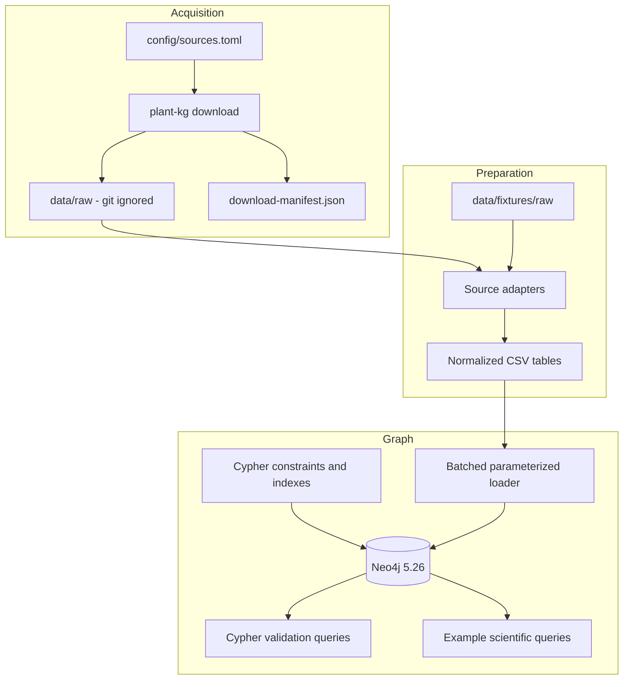

# Architecture

## Goals

The system turns four heterogeneous public sources into a small, inspectable Neo4j
graph without requiring Neo4j plugins or redistributing upstream data. The same
normalization, loading, and validation paths are used for the deterministic fixture
and for full data.

## Pipeline

### 1. Acquisition

`plant-kg download` reads typed source declarations from `config/sources.toml`.
Downloads are streamed to a `.part` file and published with an atomic rename only
after a successful transfer and any declared checksum verification. JASPAR API
pagination is resolved into one local JSON artifact. The generated manifest records
the source URL, byte size, SHA-256 digest, and retrieval time.

The fixture profile never enters this stage and requires no network access.

### 2. Source adapters

Each adapter owns one external format:

- `araport.py` streams gene features from plain or gzip-compressed GFF3 and normalizes
  percent-encoded attributes.
- `dap_seq.py` converts BED-style peak coordinates to the Araport convention and
  aggregates promoter overlaps into putative TF-target rows. The full pipeline
  excludes `_colamp-` ampDAP-seq files.
- `jaspar.py` filters records to *A. thaliana* (NCBI taxonomy 3702), computes a
  deterministic consensus from each PFM, and links a motif only on an exact,
  case-insensitive Araport symbol match.
- `y2h.py` retains `AI1` rows, removes transcript suffixes, validates both endpoints
  against Araport11, and canonicalizes pairs for an undirected analytical view.
  Homodimer observations are preserved as self-loops.

Adapters emit simple dictionaries. CSV writing centralizes column order, UTF-8
encoding, LF line endings, and deterministic sorting.

### 3. Normalized seam

Seven normalized tables separate external parsing from graph persistence:
`datasets`, `genes`, `motifs`, `metal_focus`, `tf_motifs`, `dap_targets`, and
`y2h_interactions`. Their contract is documented in
[the data dictionary](data-dictionary.md).

This seam keeps failures local: adapters can be tested without Neo4j, and the loader
can be tested with small, stable CSVs rather than live upstream services.

### 4. Graph persistence

The schema is applied with `IF NOT EXISTS`. The loader sends parameterized lists to
Neo4j using `UNWIND`, processes bounded batches, and `MERGE`s stable keys. It neither
uses APOC nor relies on the server's import directory. Repeating an identical load is
idempotent.

Load order preserves endpoint availability:

1. datasets
2. genes
3. motifs
4. metal-focus annotations
5. gene-to-motif links
6. putative DAP target links
7. Y2H links

### 5. Validation

Cypher files under `cypher/validation/` return a stable `check` and integer
`violations` contract. The CLI reports each result and exits nonzero when any
violation is present. Checks cover graph shape, identifier and coordinate integrity,
dataset provenance, and relationship endpoints and required properties. Scientific
query results are observations rather than integrity requirements.

## Runtime boundaries

Configuration enters through CLI options and the `NEO4J_URI`, `NEO4J_USER`,
`NEO4J_PASSWORD`, and `NEO4J_DATABASE` environment variables. The Python process
connects through Bolt; Neo4j is otherwise an independent service. `docker-compose.yml`
provides a pinned local Neo4j Community image and a named data volume.

## Test strategy

- Adapter unit tests assert parsing, coordinate conversion, filtering, and
  deterministic normalization.
- Pipeline tests assert exact fixture table counts and provenance identifiers.
- Schema tests inspect every required uniqueness constraint.
- Integration tests load the fixture into a real Neo4j service, repeat the load to
  prove idempotence, and run all validation queries.
- GitHub Actions supplies Neo4j as an isolated service and does not contact upstream
  biological-data hosts.

## Durable decisions

- [ADR 0001](adr/0001-locus-level-protein-model.md): locus-level protein proxies
- [ADR 0002](adr/0002-derived-dap-targets.md): promoter-overlap-derived DAP targets
- [ADR 0003](adr/0003-download-dont-redistribute.md): download, do not redistribute
